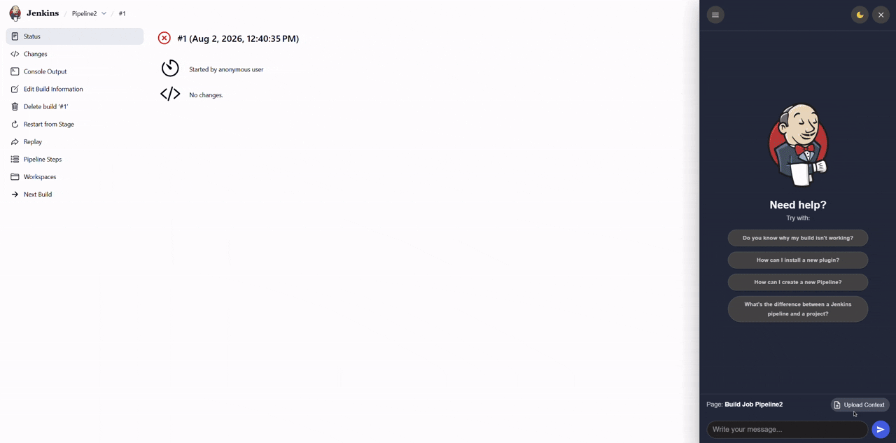

# AI Chatbot to Guide User Workflow

## Introduction

This plugin is an AI-powered chatbot powered by an agent that aims to help both novice and experienced Jenkins users by minimizing debugging and setup time. The agent features several tools to retrieve current Jenkins context, such as build logs and pipeline configurations, and also includes a Hybrid Retriever that searches the official documentation and community discussions to provide the user with precise root cause analysis and concrete solutions. Architecturally, it uses a decoupled FastAPI backend, ensuring zero computational overhead on the Jenkins Controller. The system is extremely flexible: it is designed with a privacy-first approach, optimized for on-premises open-source LLMs (using Ollama), and supports integration with third-party APIs.

> **Note**: The plugin was developed 🛠️ as part of a Google Summer of Code 2026 ☀️ project.

**Question**: Do you know why the build failed?

**Question**: How can I install a new plugin?

## Getting started

### User tutorial
Here you can find a tutorial on how to quickly install and configure the plugin.: [User Guide](https://jenkinsci.github.io/user-guide-ai-chatbot-plugin/user-guide/index.html)

### Contributor Docs
If you would like to contribute to the plugin, you can find the documentation here.: [Developer Docs](https://jenkinsci.github.io/user-guide-ai-chatbot-plugin/developer-docs/index.html)

## Contributing

Refer to our [contribution guidelines](https://github.com/jenkinsci/.github/blob/master/CONTRIBUTING.md)

## LICENSE

Licensed under MIT, see [LICENSE](LICENSE.md)

