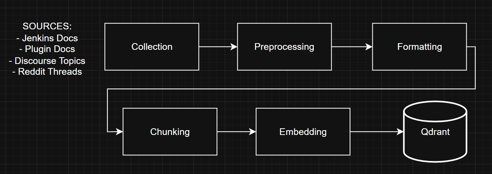

# Data

If you only need to use the plugin, you can start the data retrieval pipeline by executing: 
```bash
python -m data.manager --sources jenkins_docs plugin_docs reddit_threads discourse_topics
```

When this process will be finished the data will be stored inside Qdrant vectordb and the 
agent will be able to fetch it using `fetch_from_vectordb` tool.

> **Note**: Make sure you're in the backend directory before running this script and that Qdrant db container is running.

This section documents all phases of the data pipeline.

The code is stored under:
```
backend/data/
```

Data is collected from four different sources: 
- **Jenkins official documentation**
- **Discourse community topics**
- **Reddit threads**
- **Jenkins Plugins documentation**

## Data Pipeline

The different phases of the data pipeline are as follows:



```{toctree}
:maxdepth: 1

collection
preprocessing
formatting
chunking
embedding
```

## Contextual Retrieval

Contextual retrieval is a technique invented by Anthropic to improve the accuracy of hybrid retrieval.

The main problem when chunking a document is the resulting loss of context.

This technique involves having an LLM write a short summary for each chunk, based on the entire document.

It significantly reduces the number of failed searches in RAG pipelines. It works best when combined with a reranking model for optimal results.

Learn more:
- https://www.datacamp.com/tutorial/contextual-retrieval-anthropic
- https://platform.claude.com/cookbook/capabilities-contextual-embeddings-guide

After retrieval, the short summary is removed before sending the retrieved result to the agent.